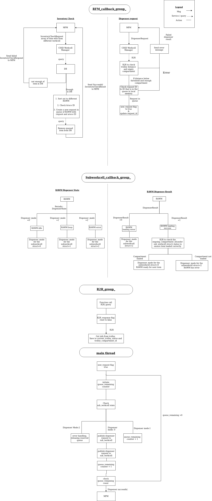

# cssd_workcell_manager (cssd_wm)
This is a ros2 package to manage multiple workcells. The cssd_wm consist of a database to take note of the inventory of the workcells under it.

It is capable of
1. Checking the db for the availability of the items
2. Taking in request consisting a mix of item that the workcell hold under it
3. Queuing the request until it is ready for pickup
4. Sending single item request to individual workcell according to *DispenserRequest.msg* until the request is complete

## Logic and message flow
***for flow of the code, look in documentation folder***


## Acronym
RAWM = Robot Arm Workcell Manager

## Installing Dependencies
1. mysql server and cpp connect
```
sudo apt-get install mysql-server
sudo apt-get install libmysqlcppconn-dev=1.1.9-1
```
2. [xbee_interfaces](https://github.com/RMFHOPE/xbee_interface)

3. [rmf_msgs](null)

## Setup The Environment

### Package Complilation
```
colcon build --symlink-install --packages-select cssd_workcell_manager
```

### Simple Mysql DB Setup
```
# 1. enter mysql application
sudo mysql -u root -p

# 2. Create new user for cppconn
CREATE USER '$USER'@'localhost' IDENTIFIED BY '$PASSWORD';

# 3. create database
CREATE DATABASE inventory;

# 4. select database
USE inventory;

# 5. Create table
CREATE TABLE workcell (aruco_id INT, item VARCHAR(30) );

# 6. Populate table
exit
cd ros2_ws/src/cssd_workcell_manager/db_repopulation
./db_repopulation
```

### For now username & password are 'malcomneo'. If user and password has been set differently, please change and rebuild the repopulation code as shown below.

#### cssd_workcell_manager.cpp
```
con = driver->connect("tcp://127.0.0.1:3306", "malcomneo", "malcomneo");
```
#### db_repopulate.cpp

```
con = driver->connect("tcp://127.0.0.1:3306", "malcomneo", "malcomneo");

#rebuild
sudo g++ -Wall -I/usr/include/cppconn -o db_repopulation db_repopulate.cpp -L/usr/lib -lmysqlcppconn
```
## Parameters
- dispenser_name: name of the workcell

- database_name: the name of the database the workcell is using

- max_request_size: the maximum request / inventory check that can be sent. Usually is the maximum compartment of agv

- R2R_docking_distance_threshold: The minimum distance R2R should respond

- R2R_server_name: topic name which R2R will request from

- **inventory**
  Used to keep track of the inventory each subworkcell hold. <br/>
  Format: subworkcell(number)_inventory <br/>
  Number is to be range from 1 to the number of workcell you insert at launch command

## Running the node
1. Make sure that the `parameters.yaml` file in params folder is changed to the appropriate parameter (e.g password, inventory, etc mentioned above).

2. To launch CSSD workcell manager
```
ros2 run cssd_workcell_manager cssd_workcell_manager <$NUM_OF_WORKCELL>  __params:={$ROS2_WS}/src/cssd_workcell_manager/cssd_workcell_manager/params/parameters.yaml
```

3.Demo. Send a Meta Fleet Manager inventory check and dispenser request message
```
 ros2 topic pub --once /dispenser_inventory_check_request rmf_msgs/msg/InventoryCheckRequest "{check_id: 123, items: [{item_type: "basin", quantity: 1}, {item_type: "instrument1", quantity: 1}]}"

ros2 topic pub --once /dispenser_request rmf_msgs/msg/DispenserRequest "{dispenser_name: "cssd_workcell", request_id: 123, items: [{item_type: "basin", quantity: 1}, {item_type: "instrument1", quantity: 1}]}"

```

## TODO
- use `std::map` for `RAWM_pointer`, and change naming: `current_tasks_map_obj`
- tidy `task_execution_thread` function
- $NUM_OF_WORKCELL in rosparam
- test R2R_query and handling of compartment
